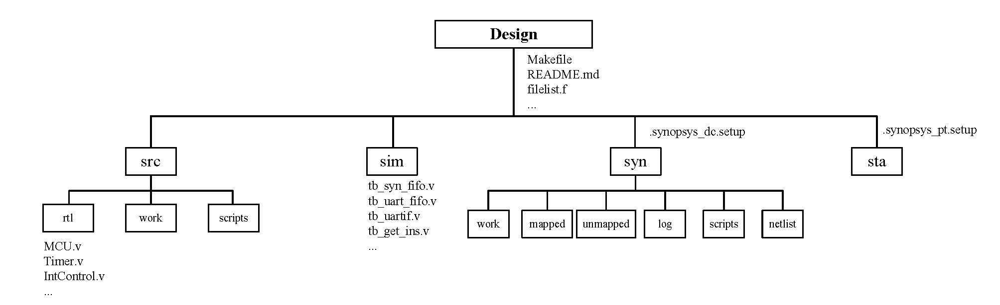
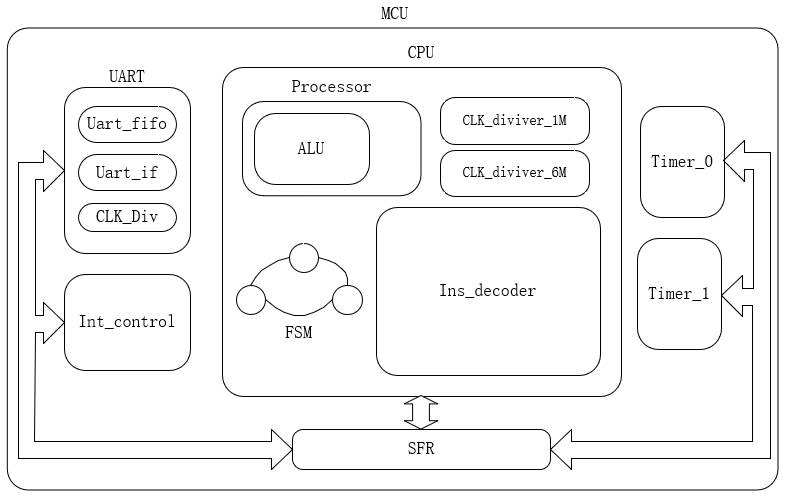

# 基于8051指令集的8位MCU设计
&emsp;&emsp;本设计 MCU 包括运算控制器、算术逻辑单元、指令译码器、分频器、指令控制、复位控制、计时器、中断程序控制器、串口控制与FIFO等，实现了经典 8051MCU 的绝大部分指令功能。
## 环境
&emsp;&emsp;设计所使用的软件环境为 Synopsys 公司的用于数字设计的软件集合，包括编译使用的 VCS 、波形仿真使用的 Verdi 、综合以及时序面积约束使用的 Design Compiler 、 STA 使用的 Prime Time 以及形式验证所使用的 Formality 。整个软件环境配置在 WSL2 的 ubuntu 子系统中，并使用 vscode remote 链接运行。
## 文件说明
&emsp;&emsp;文件目录结构如下

### 模块说明
&emsp;&emsp;所有的 module 设计代码都保存在 [src/rtl]( ./src/rtl/) 目录下，包括：

1. [MCU.v]( ./src/rtl/MCU.v) ： 设计的 MCU 顶层模块，在其中对 CPU 、定时计数器、中断控制器、串口控制器以及一块 FIFO 控制进行了例化；
2. [CPU.v]( ./src/rtl/CPU.v) ：  CPU 模块，作为 MCU 的核心，提供了算术逻辑运算，指令译码，数据读写控制、运行状态转移以及响应中断等功能；
3. [InsDecoder.v]( ./src/rtl/InsDecoder.v) ： 指令译码器模块，对从 ROM 读取到的指令进行译码，从指令恢复出对应的读写、计算控制信号以及操作数；
4. [Process.v]( ./src/rtl/Process.v) ： 运算处理控制器，用于控制执行除了数据读写以外的算数逻辑赋值等运算操作，通过将控制信号和操作数传入 ALU 实现数据处理；
5. [ALU.v]( ./src/rtl/ALU.v) ： 算数运算模块，实现算数运算、逻辑运算和位运算；
6. [ClkDiv.v]( ./src/rtl/ClkDiv.v) ： 任意倍时钟分频模块，通过传入的参数实现任意奇偶倍时钟分频；
7. ~~[ALEGen.v]( ./src/rtl/ALEGen.v) ： ALE 信号产生模块，产生特殊占空比的 ALE 信号；~~
8. [IntControl.v]( ./src/rtl/IntControl.v) ： 中断控制模块；
9. [IntArbiter.v]( ./src/rtl/IntArbiter.v) ： 中断仲裁模块，根据中断优先级控制在多个中断源发出中断响应信号时选择高优先级中断对对应的中断标志位置位，以及在响应中断之后撤除对应的中断标志；
10. [Timer.v]( ./src/rtl/Timer.v) ： 定时计数器模块，实现按照时钟计时或者按照外部输入信号计数，具有四种工作模式：16位定时器模式、13位定时器模式、8位自动装填定时器模式、计数器模式；
11. [UartIf.v]( ./src/rtl/UartIf.v) ：  UART 串口通信模块，实现将串口FIFO中的数据通过 UART 通信协议进行发送，以及以16倍波特率进行接收串口数据采样，并产生对应的串口中断标志；
12. [UartFiFo.v]( ./src/rtl/UartFiFo.v) ： 串口异步 fifo 模块，将要发送的数据缓存，并交给串口进行发送，以及在使用独立串口时钟的时候对 MCU 时钟和串口时钟进行数据同步；
13. [syn_fifo.v]( ./src/rtl/syn_fifo.v) ： 同步 fifo 模块；
14. [Uart.v]( ./src/rtl/Uart.v) ： 串口顶层模块，内部包括串口通信接口以及一块fifo控制器；
15. [fifo_ram.v]( ./src/rtl/fifo_ram.v) ： fifo 中的 ram 模块，仅仿真；
16. [bin2gray.v]( ./src/rtl/bin2gray.v) ： 二进制转化为格雷码模块；
17. [gray2bin.v]( ./src/rtl/gray2bin.v) ： 格雷码转化为二进制模块；
18. [para.vh]( ./src/rtl/para.vh) ： 宏定义。
&emsp;&emsp;设计的系统结构如图

## 编译
&emsp;&emsp; 将需要编译的rtl文件名记录在[根目录](./)下的[filelist.f](./filelist.f)文件中，并使用 make com 命令进行编译，具体参数命令见[Makefile](./Makefile)文件。清除编译产生的文件使用 make clr 命令。
## 综合
&emsp;&emsp; 在[syn](./syn)目录下运行DC，在dc_shell下使用
```
    source $scripts_path/read.tcl
    source $scripts_path/com.tcl
    source $scripts_path/report.tcl
```
在[log](./syn/log/)目录下查看对应的综合报告
## STA